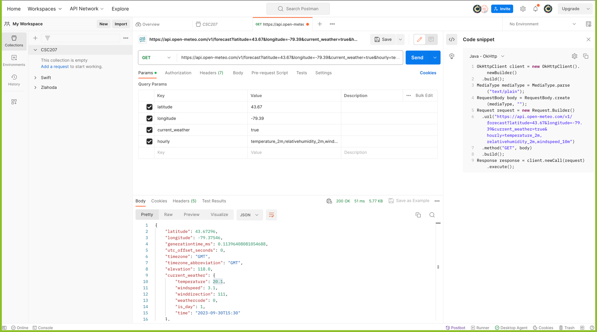
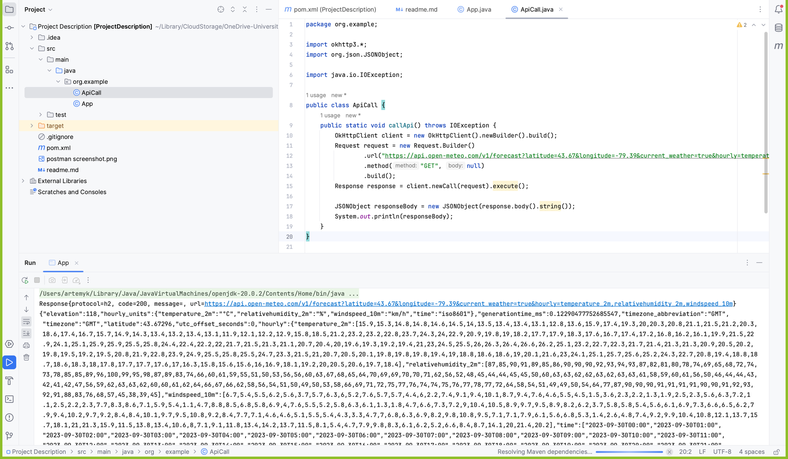

# Project Domain

**Outfit Manager**
- Create and modify a wardrobe of clothing items a user has
- Generate an outfit for the user based on the weather and their existing wardrobe
- Use fashion tagging API to create and log characteristics of pictures of user's clothing for wardrobe 
- Use weather API to determine weather conditions in order to select suitable clothes

# Description

Our idea was for an app that would generate users an outfit to wear for the day based on specific conditions.
The current implementation creates an outfit randomly, except for weather suitability. That is to say,
the random outfit would always be weather appropriate. 

In the future, we would implement features to reduce the randomness of the generated outfit. so a user
could select outfit parameters such as specific colours, warm or cool tones, the formality of the clothes, or 
the inclusion of one or more specific clothing items.

Another possibility would be to add promotional integration to have brands promote their clothes to interested
users.

# Weather API

The API we're using to get weather data is [OpenMeteo](https://open-meteo.com/).

# Fashion Tagging API

The API we're using to tag clothing images is [Clarifai](https://www.clarifai.com/computer-vision).